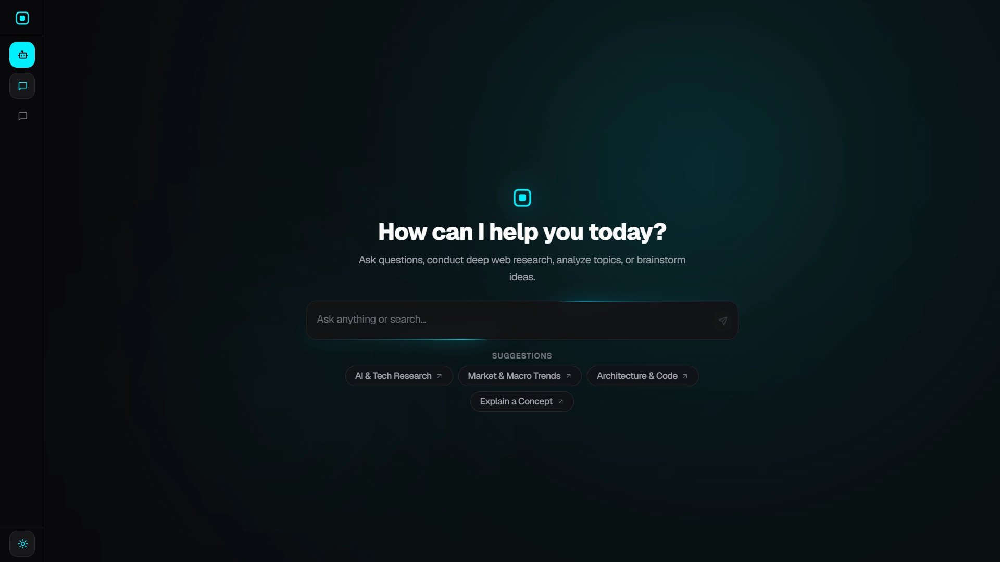

# Sterling — Intelligent AI Research Agent & Assistant Desk

<p align="left">
  
  
  
  
  
  
</p>

Sterling is a fast, high-signal AI research assistant and intelligence desk built with Next.js 16, Vercel AI SDK, and Exa AI neural search.



---

## Key Features

- **Autonomous Research Engine**: Real-time multi-step thinking with Exa AI web search & breaking news briefings.
- **Multi-Session Workspace**: Persistent conversation threads with 0ms switching via Dexie IndexedDB.
- **Adaptive Thinking Timeline**: Real-time SSE stream rendering for thought steps, tools, and token metrics.
- **Modern Design System**: Sleek dark/light theme, custom scroll orchestration, and Framer Motion micro-animations.

---

## Quick Start

### 1. Requirements
- [Bun](https://bun.sh/) `1.4.0+`

### 2. Install Dependencies
```bash
bun install
```

### 3. Environment Setup
Create a `.env.local` file:
```env
FIREWORKS_API_KEY=your_fireworks_api_key
EXA_API_KEY=your_exa_api_key
```

### 4. Run Development Server
```bash
bun run dev
```

---

## Verification & Tooling

```bash
# Type check with TS7
bun x tsc --noEmit

# Lint with Oxlint
bun run lint

# Production build
bun run build
```